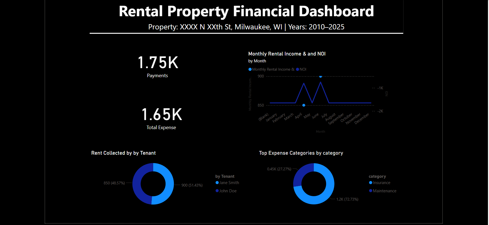

# Rental Property Financial Dashboard

📊 **A Power BI + PostgreSQL dashboard for long-term rental performance analysis**

Walkthru of project: https://youtu.be/Tj4k1GtpL7Y

---

## 🔍 Overview

This interactive dashboard tracks 15+ years of financial data for a single-family rental property, providing high-level KPIs and granular insights for investors, landlords, or analysts.

- Built in **Power BI** and powered by a **PostgreSQL backend**
- Fully mock dataset with real-world lease cycles, payment behavior, and expenses
- Clean dark-themed layout inspired by Spotify and Pixar-style dashboards

---

## 💡 Key Features

- **KPI Cards**  
    
    
    
  

- **Visuals**
  - 📈 Monthly Income & NOI (Line Chart)  
      
    
  - 🍩 Rent Collected by Tenant  
    
  - 🧾 Top Expense Categories  
    
  - 📊 Additional Insights  
      
      
      
      
    

---

## 🧱 Dataset Schema

| Table | Description |
|-------|-------------|
| `tenants` | Tenant ID, Name, Lease Period, Status |
| `invoices` | Monthly rent invoices issued per tenant |
| `payments` | Payment records tied to invoices |
| `expenses` | Property expenses with category breakdowns |

---

## 🛠 Technologies Used

- **PostgreSQL 17**
- **Power BI Desktop**
- DAX Measures + Calculated Columns
- SQL Table Relationships + Sample Data

---

## 📁 Files Included

- `Dashboard/Rental_Property_Financial_Dashboard.pbix` – Power BI file
- `SQL/rental_financial_analytics_schema.sql` – Create & populate tables
- `README.md` – Project overview and instructions
- `Screenshots/` – Full output preview images

---

## 🧠 Skills Demonstrated

- Financial KPI development
- Relational SQL modeling
- Power BI dashboard design
- DAX performance calculations
- Real estate rental analytics

---

## 📈 Sample Output

---

## 📎 License

MIT License — feel free to adapt and build for your own portfolio.
